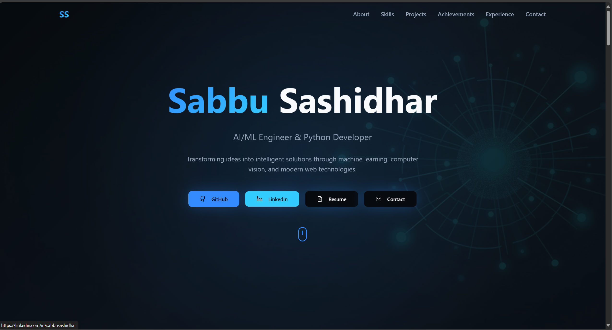

# Portfolio Website

A modern, responsive portfolio website built with React, TypeScript, and Tailwind CSS. This portfolio showcases your skills, projects, achievements, and experience with an integrated AI chatbot feature.



## Features

- 🎨 **Modern UI/UX** - Built with shadcn/ui components and Tailwind CSS
- 🤖 **AI Chatbot** - Integrated AI-powered chatbot for interactive user engagement
- 📱 **Fully Responsive** - Works seamlessly on desktop, tablet, and mobile devices
- 🌓 **Dark/Light Theme** - Theme switching capability with next-themes
- 🚀 **Fast Performance** - Built with Vite for optimal performance
- 📄 **Multiple Sections**:
  - Hero section with call-to-action
  - About section
  - Skills showcase
  - Projects portfolio
  - Older portfolio work
  - Achievements & awards
  - Professional experience
  - Contact form
- 🔍 **SEO Optimized** - Includes sitemap and robots.txt
- 🛠️ **Developer Friendly** - TypeScript, ESLint, and modern tooling

## Tech Stack

- **Framework**: React 18 with Vite
- **Language**: TypeScript
- **Styling**: Tailwind CSS + shadcn/ui components
- **Routing**: React Router DOM
- **State Management**: React Query (@tanstack/react-query)
- **Form Handling**: React Hook Form + Zod validation
- **UI Components**: Radix UI (via shadcn/ui)
- **Animations**: Tailwind CSS animate, Lucide icons
- **Theme**: Next-themes
- **Charts**: Recharts
- **Date Handling**: date-fns
- **Toast Notifications**: Sonner

## Prerequisites

Before you begin, ensure you have the following installed on your system:

- [Node.js](https://nodejs.org/) (v18 or higher)
- [npm](https://www.npmjs.com/) or [yarn](https://yarnpkg.com/) or [bun](https://bun.sh/)
- [Git](https://git-scm.com/)

## Installation & Setup

### 1. Clone the Repository

```bash
git clone https://github.com/sashidhar498/portfolio.git
cd portfolio
```

### 2. Install Dependencies

Using npm:
```bash
npm install
```

Using yarn:
```bash
yarn install
```

Using bun:
```bash
bun install
```

### 3. Environment Variables

This project doesn't require any environment variables for basic functionality. However, if you plan to add backend features, create a `.env` file:

```bash
cp .env.example .env
```

### 4. Run Development Server

```bash
npm run dev
```

This will start the development server at `http://localhost:5173` (or another available port).

### 5. Build for Production

```bash
npm run build
```

This creates an optimized production build in the `dist/` directory.

### 6. Preview Production Build

```bash
npm run preview
```

## Project Structure

```
portfolio/
├── public/                 # Static assets
│   ├── assets/            # Images, PDFs, etc.
│   ├── sitemap.xml        # SEO sitemap
│   └── robots.txt         # SEO robots file
├── src/
│   ├── components/        # React components
│   │   ├── ui/           # shadcn/ui components
│   │   ├── AIChatbot.tsx # AI chatbot component
│   │   ├── Hero.tsx      # Hero section
│   │   ├── About.tsx     # About section
│   │   ├── Skills.tsx    # Skills section
│   │   ├── Projects.tsx  # Projects section
│   │   ├── Experience.tsx # Experience section
│   │   ├── Achievements.tsx # Achievements section
│   │   ├── Contact.tsx   # Contact section
│   │   └── Navigation.tsx # Navigation bar
│   ├── pages/            # Page components
│   │   ├── Index.tsx     # Main landing page
│   │   └── NotFound.tsx  # 404 page
│   ├── lib/              # Utility functions
│   ├── hooks/            # Custom React hooks
│   ├── assets/           # Static assets
│   ├── App.tsx           # Main application component
│   ├── main.tsx          # Application entry point
│   └── index.css         # Global styles
├── package.json          # Dependencies and scripts
├── tsconfig.json         # TypeScript configuration
├── tailwind.config.ts    # Tailwind CSS configuration
├── vite.config.ts        # Vite configuration
└── README.md             # This file
```

## Available Scripts

| Script | Description |
|--------|-------------|
| `npm run dev` | Start development server with hot reload |
| `npm run build` | Build for production |
| `npm run build:dev` | Build in development mode |
| `npm run lint` | Run ESLint for code quality |
| `npm run preview` | Preview production build locally |
| `npm run deploy` | Deploy to GitHub Pages |

## Deployment

### Deploy to GitHub Pages

This project includes a pre-configured deployment script for GitHub Pages.

#### 1. Prepare Your Repository

Make sure your project is in a GitHub repository:

```bash
git init
git add .
git commit -m "Initial commit"
git branch -M main
git remote add origin https://github.com/yourusername/portfolio.git
git push -u origin main
```

#### 2. Configure GitHub Pages

1. Go to your repository on GitHub
2. Navigate to **Settings** → **Pages**
3. Under "Build and deployment", select:
   - **Source**: Deploy from a branch
   - **Branch**: `gh-pages` (this will be created automatically)
   - **Folder**: `/` (root)

#### 3. Deploy

Run the deployment script:

```bash
npm run deploy
```

This will:
- Build your project
- Create a `gh-pages` branch
- Push the built files to GitHub
- GitHub Pages will automatically deploy your site

#### 4. Access Your Site

After deployment, your site will be available at:
```
https://yourusername.github.io/portfolio/
```

### Alternative Deployment Options

#### Vercel

1. Install Vercel CLI: `npm i -g vercel`
2. Run: `vercel`
3. Follow the prompts

#### Netlify

1. Install Netlify CLI: `npm i -g netlify-cli`
2. Run: `netlify deploy`
3. Follow the prompts

#### Firebase Hosting

1. Install Firebase CLI: `npm i -g firebase-tools`
2. Run: `firebase init hosting`
3. Run: `npm run build && firebase deploy`

## Customization

### Update Portfolio Content

Edit the components in `src/components/` to update your portfolio content:

- **Hero**: Main introduction and call-to-action
- **About**: Personal bio and information
- **Skills**: Your technical skills
- **Projects**: Your project portfolio
- **Experience**: Work experience
- **Achievements**: Awards and accomplishments
- **Contact**: Contact information and form

### Change Theme Colors

Edit `tailwind.config.ts` to customize colors:

```typescript
export default {
  theme: {
    extend: {
      colors: {
        primary: {
          DEFAULT: '#your-primary-color',
          foreground: '#your-foreground-color',
        },
      },
    },
  },
}
```

### Add New Sections

1. Create a new component in `src/components/`
2. Import and add it to `src/pages/Index.tsx`
3. Style using Tailwind CSS classes

### Update AI Chatbot

Edit `src/components/AIChatbot.tsx` to customize the chatbot behavior and responses.

## Contributing

Contributions are welcome! Please follow these steps:

1. Fork the repository
2. Create a feature branch: `git checkout -b feature/amazing-feature`
3. Commit your changes: `git commit -m 'Add amazing feature'`
4. Push to the branch: `git push origin feature/amazing-feature`
5. Open a Pull Request

## SEO & Performance

This project includes:
- **Sitemap**: `public/sitemap.xml`
- **Robots.txt**: `public/robots.txt`
- **Meta Tags**: Optimized for search engines
- **Performance**: Vite-optimized builds
- **Accessibility**: Semantic HTML and ARIA labels

## Troubleshooting

### Common Issues

**Port already in use:**
```bash
npm run dev -- --port 3000
```

**Build fails:**
```bash
rm -rf node_modules package-lock.json
npm install
npm run build
```

**Tailwind CSS not working:**
```bash
npm run build
```

**TypeScript errors:**
```bash
npm run lint
```

### Getting Help

If you encounter issues:
1. Check the [GitHub Issues](https://github.com/sashidhar498/portfolio/issues)
2. Review the [React Documentation](https://react.dev/)
3. Check [Tailwind CSS Documentation](https://tailwindcss.com/)

## License

This project is open source and available under the [MIT License](LICENSE).

## Acknowledgments

- [shadcn/ui](https://ui.shadcn.com/) - UI component library
- [Vite](https://vitejs.dev/) - Build tool
- [Tailwind CSS](https://tailwindcss.com/) - Utility-first CSS framework
- [Radix UI](https://www.radix-ui.com/) - Accessible UI primitives
- [Lucide Icons](https://lucide.dev/) - Icon library

---

**Built with ❤️ using React, TypeScript, and modern web technologies**

*Last updated: January 2026*